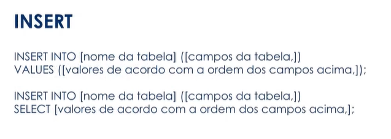
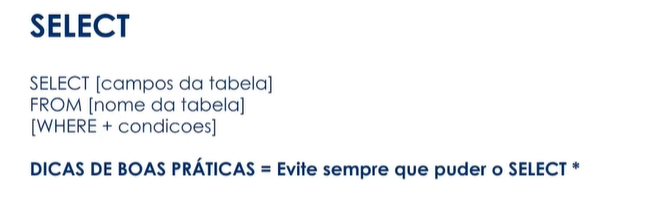
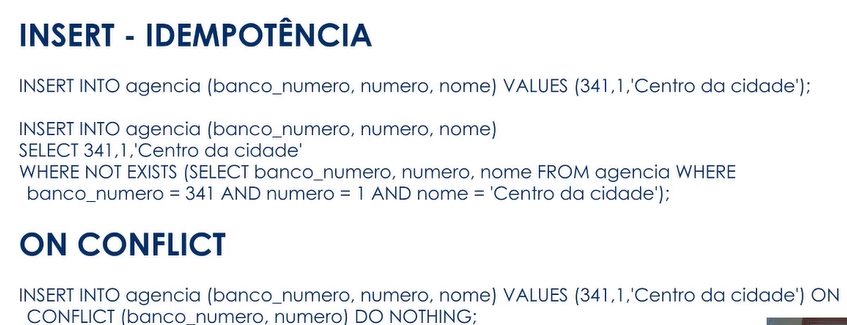
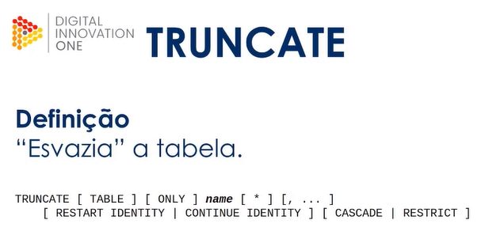

Porfessor Daniel Robert Costa
DATABASE ENGINEER - QUINTO ANDAR

# **Introdução ao banco de dados PostgreSQL**

### **Fundamentos de bancos de dados**

### **banco de dados**

Um banco de dados é uma coleção organizada de informações - ou dados - estruturadas, normalmente armazenadas eletronicamente em um sistema de computador. Um banco de dados é geralmente controlado por um sistema de gerenciamento de banco de dados (DBMS). Juntos, os dados e o DBMS, juntamente com os aplicativos associados a eles, são chamados de sistema de banco de dados, geralmente abreviados para apenas banco de dados.

Os dados nos tipos mais comuns de bancos de dados em operação atualmente são modelados em linhas e colunas em uma série de tabelas para tornar o processamento e a consulta de dados eficientes. Os dados podem ser facilmente acessados, gerenciados, modificados, atualizados, controlados e organizados. A maioria dos bancos de dados usa a linguagem de consulta estruturada (SQL) para escrever e consultar dados.
>> https://www.oracle.com/br/database/what-is-database/


### **Fundamentos de banco de dados**

### **o que são informações?**

Estruturação de dados, organização de dados. Conjunto de dadosd relacionados entre si que geram valor, que criam sentidos aos dados. Material do conhecimento. 

### **Modelos relacional**

https://www.devmedia.com.br/modelagem-relacional/19614

Modelo mais comum, que classifica e organiza as informações em tabelas com linhas e colunas. As linhas, ou tuplas, são os dados organizados, são os valores das tabels, e as colunas são os atributos destes dados.

### **Tabelas**

Conjuntos de dados dispostos em colunas e linhasd referente a um objetivo comum. As coluns são consideradas como "campos da tabela", como atributos da tabela. As linhas de uma tabela são chamadas também de tuplas,e é onde estão contidos os valores, os dados.


>>Imagem de uma tabela sendo relacionada com outra.

O que pode ser definido como tabelas?

* Coisas tangíveis
  * Elementos físicos(carro,produto, animal)
* Funções
  * Perfid de usuário, status de compra
* Eventos ou ocorrências
  * Produtos de um pedido, histórico de dados


### **Colunas importantas**

* Chave Primária/ Primary key / pk
  * Conjunto de um ou maid campos que nunca se repetem. Identidade da tabela. São utilizados como índice de referência na criação de realcionamentos entre tabelas.

* Chaves Estrangeira / Foreign / Fk
  * Valorde referência a uma pk de outra tabela da mesma tabela para criar um relacionamento.


>> Tabela criada com relacionamentos fortes, são mostrado as chaves primárias e estrangeiras. Desse modo temos uma relação forte.

### **Sistemsa de gerenciamento de banco de dados ou sustema de gestão de base de dados.**

Chamamos pela sigla SGBD. Conjunto de programas ou softwares responsável pelo gerenciamento de um banco de dados. Programa que facilitam a administração de um banco de dados.

### **PostgreSQL**

Sistema de gerenciamento de banco de dados objato relacional.

Teve início no Departamento de Ciência da Computação na Universidade da califórniaa em Berkeley em 1987.

SGBD Opensource.


>> Arquitetura multiprocessos


>> Modelo clinete servidor

### **Principais Características**

* OpenSource
* Point in time recovery
* Linguagem Procedural com suporte a várias linguagens de programação (perl, python, etc)
* views, functins, profcedures, triggers
* Consultas complexas e Common table expressions (CTE)
* Suporte a dados geográficos (PostGIS)
* Controle de concorrência multi-versão


### **Instalação do PostgreSQL no Ubuntu**

Site oficial: https://www.postgresql.org/
documentação: Site oficial: https://www.postgresql.org/docs/manuals/


>> Passo a passo para instalar

### **Instalação do PostgreSQL no CentOS/Red Hat**


>> Passo a passo para instalar

### **Intalação do PostgreSQL no Windows**


# **Objetos e tipos de dados do PostgreSQL**

##  **O que é o arquivo postgresql.conf**

### **O arquivo postgresql.conf**

Arquivo onde estão definidas e armazenadas todas os configuraçõe do servidor PostgreSQl.
Alguns parâmetros só podem ser alterados com uma reinicializaçáo do banco de dados. 
A view pg_setting, acessada por dentro do banco de dados, guarda todas as configurações atuais.


* postgresql.conf
Ao acesasr a view pg_settings, é possível visualizar todas as configurações atuais:

```
SELECT nome.setting
FROM pg_settings;
```
Ou é possível usar o comando:

```
SHOW [parâmetro];
```
### **Localização do arquivo postgresql.conf**
Por padrão, encontra-se dentro do diretório PGDATA definido no momento da inicialização do cluster de banco de dados.

No sistema operacional Ubuntu, se o PostgreSQL foi instalado a partir do repositório oficial, o local  do arquivo postgresql.conf será diferente do diretório de dados.

### **Configurações de conexão**

* Listen_addresses
Endereço(s) TCP/IP das interfaces que o serquidor PostgreSQL vai escutar/liberar conexões.

* Port
A porta TCP que o servidor PostgreSQL vai ouvir. O padrão é 5432.

* Max_connections
  Número máximo de conexões simultâneas no servidor PostgreSQL.

* Superuser_reserved_connections
Número de conexões (slots) reservadas para conexões ao banco de dados de super usuários.

### **Conçfigurações de autenticação**


### **Configurações de memória**


### **arquivo pg_hba.conf**

Arquivo responsável pelo controle de autentivação dos usuários no servidor PostgreSQL. 

O formato do arquivo pode ser:


### **Métodos de autenticação**


### **arquivo pg_ident.conf**

Arquivo responsável por mapear os usuários do sistema operacional com os usuários do banco de dados. Localizado no diretório de dados PGDATA de sua instalação. A opção ident deve ser utilizada no arquivo pg_hba.conf


### **Comandos administrativos**

* Ubuntu:


* CentOS


* Windows


### **Arquitetura/Hierarquia**

* Cluster:

Coleção de bancos de dados que compartilham as mesmas configurações (arquivos de configuração) do PostgreSQL e do sistema operacional (porta, listen_addresses, etc).

Podemos ter um ou mais bancos de dados. 

* Banco de dados(database)

Conjunto de schemas com seus objetos/relações (tabelas, funções, view, etc).

* Schema

Conjunto de objetos/relações(tabelas, funções views, etc)

Exemplo: 


## **Conheça a ferramnta PGAdmin**

### **PGAdmin**

Importante para conexão:

1. Liberar acesso ao cluester em postgresql.conf
2. Liberar acesso ao cluster para o usuário do banco de dados em pg_hba.conf
3. Criar/editar usuários

scram-sha-256


## **Como administrar usuários no bancos de dados**

### **Conceitos users/roles/groups**

Roles(papéis ou funções), users (usuários) e grupo de usuários são "contas", perfis de atuação em um banco de dados, que possuem permissão em comum ou específicas. Nas versões anteriores do postgreSQL 8.1, usuários e roles tinham comportamento diferentes. Atualmente roles e users são iguais. É possível que roles pertençam a outros roles.


### **Administrando user/roles/groups**


>> criando e configurando roles


### **Associação entre roles**
Quando uma role assume as permissões de outra role. Necessárioa opção INHERIT.

No momento de criação da role:

- IN ROLE (passa a pertencer a role informada)
- ROLE (a role informada passa a pertencer a nova role)

Ou após a criação da role:
- GRANT [role a ser concedida] TO [role a assumir as permissões]
 
Exemplo:


### **Desassociar membros entre roles**

REVOKE [role que será revogada] FROM [role que terá suas permissões revogadas]

REVOKE professores FROM daniel;

### **ALTERANDO UMA ROLE**


### **Excluindo uma role**

`DROP ROLE role_specification`;

Comando na prática

```
CREATE ROLE professores NOCREATEDB NOCREATEROLE INHERIT NOLOGIN NOBYPASSRLS CONNECTION LIMIT 10;
ALTER ROLE professores PASSWORD 'senha';

CREATE ROLE daniel LOGIN PASSWORD 'senha';

DROP ROLE daniel;

CREATE ROLE daniel LOGIN PASSWORD 'senha' IN ROLE professores;

DROP ROLE daniel;

CREATE ROLE daniel LOGIN PASSWORD 'senha' ROLE professores;

DROP ROLE daniel;

CREATE TABLE teste(nome varchar);
GRANT ALL ON TABLE teste TO professores;
CREATE ROLE daniel LOGIN PASSWORD 'senha'

DROP ROLE daniel;

CREATE ROLE daniel INHERIT LOGIN PASSWORD 'senha' IN ROLE professores;

REVOKE professores FROM daniel;
```

### **Administrando acessos (GRANT)**

São os privilégios de acesso aos objetos do banco de dados.

Privilégios:


### **Revoke**

Retira as permissões da role


## **Objetos e comandos do banco de dados**

### **DATABASE, SCHEMAS E OBJETOS**


### **Tabelas colunas e tipos de dados**


>> tabela com istens repetidos


Exemplo:


### **Tipos de dados**


* Tipo numéricos


* Caracter


* Datas


* Booleanos


### **DML e DDL**








COMANDOS DDL

```
CREATE TABLE IF NOT EXISTS banco (
	numero INTEGER NOT NULL,
	nome VARCHAR(50) NOT NULL,
	ativo BOOLEAN NOT NULL DEFAULT TRUE,
	data_criacao TIMESTAMP NOT NULL DEFAULT CURRENT_TIMESTAMP,
	PRIMARY KEY (numero)
);

CREATE TABLE IF NOT EXISTS agencia (
	banco_numero INTEGER NOT NULL,
	numero INTEGER NOT NULL,
	nome VARCHAR(80) NOT NULL,
	ativo BOOLEAN NOT NULL DEFAULT TRUE,
	data_criacao TIMESTAMP NOT NULL DEFAULT CURRENT_TIMESTAMP,
	PRIMARY KEY (banco_numero,numero),
	FOREIGN KEY (banco_numero) REFERENCES banco (numero)
);

CREATE TABLE IF NOT EXISTS cliente (
	numero BIGSERIAL PRIMARY KEY,
	nome VARCHAR(120) NOT NULL,
	email VARCHAR(250) NOT NULL,
	ativo BOOLEAN NOT NULL DEFAULT TRUE,
	data_criacao TIMESTAMP NOT NULL DEFAULT CURRENT_TIMESTAMP
);

CREATE TABLE IF NOT EXISTS conta_corrente (
	banco_numero INTEGER NOT NULL,
	agencia_numero INTEGER NOT NULL,
	numero BIGINT NOT NULL,
	digito SMALLINT NOT NULL,
	cliente_numero BIGINT NOT NULL,
	ativo BOOLEAN NOT NULL DEFAULT TRUE,
	data_criacao TIMESTAMP NOT NULL DEFAULT CURRENT_TIMESTAMP,
	PRIMARY KEY (banco_numero,agencia_numero,numero,digito,cliente_numero),
	FOREIGN KEY (banco_numero,agencia_numero) REFERENCES agencia (banco_numero,numero),
	FOREIGN KEY (cliente_numero) REFERENCES cliente (numero)
);

CREATE TABLE IF NOT EXISTS tipo_transacao (
	id SMALLSERIAL PRIMARY KEY,
	nome VARCHAR(50) NOT NULL,
	ativo BOOLEAN NOT NULL DEFAULT TRUE,
	data_criacao TIMESTAMP NOT NULL DEFAULT CURRENT_TIMESTAMP
);

CREATE TABLE IF NOT EXISTS cliente_transacoes (
	id BIGSERIAL PRIMARY KEY,
	banco_numero INTEGER NOT NULL,
	agencia_numero INTEGER NOT NULL,
	conta_corrente_numero BIGINT NOT NULL,
	conta_corrente_digito SMALLINT NOT NULL,
	cliente_numero BIGINT NOT NULL,
	tipo_transacao_id SMALLINT NOT NULL,
	valor NUMERIC(15,2) NOT NULL,
	data_criacao TIMESTAMP NOT NULL DEFAULT CURRENT_TIMESTAMP,
	FOREIGN KEY (banco_numero,agencia_numero,conta_corrente_numero,conta_corrente_digito,cliente_numero) REFERENCES conta_corrente(banco_numero,agencia_numero,numero,digito,cliente_numero)
);
```

COMANDOS MDL

>> https://github.com/drobcosta/digital_innovation_one


# **Fundamentos da Structured Query Language (SQL)**

Revisão

Idempotência 

Propriedade que alguamas ações/operações possuem possibilitando-as de serem executadas diversas vezes sem alterar o resultado após a aplicação inicial.

Faz o código não ter erro, caso tenha comando que são executados somente uma vez.

* Melhores práticasa em DDL

Importante as tabelas possuírem campos que realmente serão utilizados e que sirvam de atributo diareto a um objeto em comum.
 * Criar/Acrecetar colunas que "atributos básicos" do objetivo; Exemplo: tabela Cliente: coluna Telefone/coluna agencia_bancaria
 * Cuidado com regras(constrains) 
 * Cuidado com o excesso de FKs
 * Cuidado com a tomanho indevido de colunas. Exemplo: coluna cep varchar(255)

## **Conheça o DML e o Truncate**


>> ILIKE, case sensitive







## **Funções agregadas em PostgreSQL**
Como a maioria dos produtos de banco de dados relacional, o PostgreSQL suporta funções de agregação. Uma função de agregação computa um único resultado para várias linhas de entrada. Por exemplo, existem funções de agregação para contar (count), somar (sum), calcular a média (avg), o valor máximo (max) e o valor mínimo (min) para um conjunto de linhas.

Para servir de exemplo, é possível encontrar a maior temperatura mínima observada em qualquer lugar usando

```
SELECT max(temp_min) FROM clima;
```
 max
-----
  46
(1 linha)

Se for desejado saber a cidade (ou cidades) onde esta temperatura ocorreu pode-se tentar usar

```
SELECT cidade FROM clima WHERE temp_min = max(temp_min);     ERRADO
```
mas não vai funcionar, porque a função de agregação max não pode ser usada na cláusula WHERE (Esta restrição existe porque a cláusula WHERE determina quais linhas serão incluídas no cálculo da agregação e, neste caso, teria que ser avaliada antes das funções de agregação serem computadas). Entretanto, como é geralmente o caso, a consulta pode ser reformulada para obter o resultado pretendido, o que será feito por meio de uma subconsulta:

```
SELECT cidade FROM clima
    WHERE temp_min = (SELECT max(temp_min) FROM clima);
```
     cidade
---------------
 São Francisco
(1 linha)

Isto está correto porque a subconsulta é uma ação independente, que calcula sua agregação isoladamente do que está acontecendo na consulta externa.

As agregações também são muito úteis em combinação com a cláusula GROUP BY. Por exemplo, pode ser obtida a maior temperatura mínima observada em cada cidade usando
```
SELECT cidade, max(temp_min)
    FROM clima
    GROUP BY cidade;
```
     cidade      | max
-----------------+-----
 Hayward         |  37
 São Francisco   |  46
(2 linhas)

produzindo uma linha de saída para cada cidade. Cada resultado da agregação é computado sobre as linhas da tabela correspondendo a uma cidade. As linhas agrupadas podem ser filtradas utilizando a cláusula HAVING

```
SELECT cidade, max(temp_min)
    FROM clima
    GROUP BY cidade
    HAVING max(temp_min) < 40;
```

  cidade   | max
-----------+-----
 Hayward   |  37
(1 linha)

que mostra os mesmos resultados, mas apenas para as cidades que possuem os valores de max(temp_min) abaixo de 40. Para concluir, se desejarmos somente as cidades com nome começando pela letra "S" podemos escrever:

```
SELECT cidade, max(temp_min)
    FROM clima
    WHERE cidade LIKE 'S%'(1)
    GROUP BY cidade
    HAVING max(temp_min) < 40;
```

## **Trabalhando com JOINS**
As junções SQL são utilizadas quando precisamos selecionar dados de duas ou mais tabelas.

Existem as junções com estilo non-ANSI ou theta (junção com WHERE).

E as junções ANSI join (com JOIN). As junções ANSI podem ser de dois tipos, as INNER JOINS e as OUTER JOINS. A padrão é a INNER JOIN. INNER JOIN pode ser escrito com apenas JOIN.

Exemplo ANSI:

SELECT p.siape, p.senha, l.lotacao FROM pessoal p CROSS JOIN lotacoes l;
Tipos de Junções

INNER JOIN - Onde todos os registros que satisfazem à condição serão retornados.

Exemplo:

SELECT p.siape, p.nome, l.lotacao
FROM pessoal p INNER JOIN lotacoes l
ON p.siape = l.siape ORDER BY p.siape;

Exemplo no estilo theta:

SELECT p.siape, p.nome, l.lotacao
FROM pessoal p, lotacoes l
WHERE p.siape = l.siape ORDER BY p.siape;

OUTER JOIN que se divide em LEFT OUTER JOIN e RIGHT OUTER JOIN


LEFT OUTER JOIN ou simplesmente LEFT JOIN - Somente os registros da tabela da esquerda (left) serão retornados, tendo ou não registros relacionados na tabela da direita.


Primeiro, é realizada uma junção interna. Depois, para cada linha de T1 que não satisfaz a condição de junção com nenhuma linha de T2, é adicionada uma linha juntada com valores nulos nas colunas de T2. Portanto, a tabela juntada possui, incondicionalmente, no mínimo uma linha para cada linha de T1.


A tabela à esquerda do operador de junção exibirá cada um dos seus registros, enquanto que a da direita exibirá somente seus registros que tenham correspondentes aos da tabela da esquerda.

Para os registros da direita que não tenham correspondentes na esquerda serão colocados valores NULL.


Exemplo (voltar todos somente de pessoal):

SELECT p.siape, p.nome, l.lotacao
FROM pessoal p LEFT JOIN lotacoes l
ON p.siape = l.siape ORDER BY p.siape;

Veja que pessoal fica à esquerda em “FROM pessoal p LEFT JOIN lotacoes l”.


RIGHT OUTER JOIN

Inverso do LEFT, este retorna todos os registros somente da tabela da direita (right). Primeiro, é realizada uma junção interna. Depois, para cada linha de T2 que não satisfaz a condição de junção com nenhuma linha de T1, é adicionada uma linha juntada com valores nulos nas colunas de T1. É o oposto da junção esquerda: a tabela resultante possui, incondicionalmente, uma linha para cada linha de T2.

Exemplo (retornar somente os registros de lotacoes):

SELECT p.siape, p.nome, l.lotacao
FROM pessoal p RIGHT JOIN lotacoes l
ON p.siape = l.siape ORDER BY p.nome;
FULL OUTER JOIN

Primeiro, é realizada uma junção interna. Depois, para cada linha de T1 que não satisfaz a condição de junção com nenhuma linha de T2, é adicionada uma linha juntada com valores nulos nas colunas de T2. Também, para cada linha de T2 que não satisfaz a condição de junção com nenhuma linha de T1, é adicionada uma linha juntada com valores nulos nas colunas de T1.

E também as:

CROSS JOIN e SELF JOIN (para si mesmo).

Vide item 7.2.1.1 do manualoficial para mais detalhes e exemplos.

LIMIT

LIMIT (limite) juntamente com OFFSET (deslocamento) permite dizer quantas linhas desejamos retornar da consulta. Podemos retornar desde apenas uma até todas.

Sintaxe:

SELECT lista_de_campos
   FROM expressão 
   [LIMIT { número | ALL }] [OFFSET inicio]

LIMIT ALL – mesmo que imitir LIMIT.

OFFSET inicio – orienta para que a consulta retorne somente a partir de inicio.

OFFSET 0 – mesmo que omitir OFFSET.

LIMIT 50 OFFSET 11 – Deverá trazer 50 registros do 11 até o 60, caso existam.


Obs.: Quando se utiliza LIMIT é importante utilizar a cláusula ORDER BY para estabelecer uma ordem única para as linhas do resultado. Caso contrário, será retornado um subconjunto imprevisível de linhas da consulta; pode-se desejar obter da décima a vigésima linha, mas da décima a vigésima de qual ordem? A ordem é desconhecida a não ser que seja especificado ORDER BY. Isto é uma conseqüência inerente ao fato do SQL não prometer retornar os resultados de uma consulta em qualquer ordem específica, a não ser que ORDER BY seja utilizado para impor esta ordem.

Exemplos:

SELECT id, name FROM products ORDER BY name LIMIT 20 OFFSET 1; 
Irá retornar os registros do 1 até o 20.

SELECT * FROM news_m LIMIT $inicio, $n_resultados
O comando "SELECT * FROM news_m LIMIT $n_resultados OFFSET $inicio"

irá pesquisar as noticias da tabela "news_m" começando do resultado "$inicio" e irá listar "$n_resultados".

Exemplo: "SELECT * FROM news_m LIMIT 3 OFFSET 2" irá exibir 3 notícias a partir da 2a. notícia da tabela, ou seja, irá exibir as notícias 2, 3 e 4 da nossa tabela "news_m".


INNER JOIN
Definição e exemplos no site db.apache.org e muitas outras boas informações sobre SQL:

http://db.apache.org/derby/docs/dev/pt_BR/ref/rrefsqlj35034.html

INNER JOIN (junção interna) é uma Operação JOIN que permite especificar uma cláusula de junção explícita.

Sintaxe

ExpressãoTabela [ INNER ] JOIN ExpressãoTabela { ON ExpressãoBooleana }

A cláusula de junção pode ser especificada utilizando ON com uma expressão booleana. O escopo das expressões na cláusula ON inclui as tabelas correntes, e as tabelas nos blocos de consulta externos ao SELECT corrente. No exemplo a seguir, a cláusula ON faz referência às tabelas correntes:

SELECT *
FROM SAMP.EMPREGADOS INNER JOIN SAMP.EQUIPES
ON EMPREGADOS.SAL�?RIO < EQUIPES.SAL�?RIO;
A cláusula ON pode fazer referência a tabelas que não estão sendo juntadas, e não é obrigada a fazer referência a nenhuma das tabelas sendo juntadas (embora tipicamente o faça).

-- Junção das tabelas ATIV_EMP e EMPREGADOS
-- selecionar todas as colunas da tabela ATIV_EMP e
-- adicionar o sobrenome do empregado (ÚLTIMO_NOME) da tabela
-- EMPREGADOS a todas as linhas do resultado

SELECT SAMP.ATIV_EMP.*, ÚLTIMO_NOME
     FROM SAMP.ATIV_EMP JOIN SAMP.EMPREGADO
     ON ATIV_EMP.NUM_EMP = EMPREGADOS.NUM_EMP;

-- Juntar as tabelas EMPREGADOS e DEPARTAMENTOS,
-- selecionar o número do empregado (NUM_EMP),
-- o sobrenome do empregado (ÚLTIMO_NOME),
-- o número do departamento (DEP_TRAB na tabela EMPREGADOS e
-- NUM_DEP na tabela DEPARTAMENTOS)
-- e o nome do departamento (NOME_DEP)
-- de todos os empregados nascidos (DATA_NASC) antes de 1930.

SELECT NUM_EMP, ÚLTIMO_NOME, DEP_TRAB, NOME_DEP
     FROM SAMP.EMPREGADOS JOIN SAMP.DEPARTAMENTOS
     ON DEP_TRAB = NUM_DEP
     AND YEAR(DATA_NASC) < 1930;

-- Outro exemplo de "gerar" novos valores de dado,
-- utilizando uma consulta que seleciona da cláusula VALUES
-- (que é uma forma alternativa de FULLSELECT).

SELECT *
FROM (VALUES (3, 4), (1, 5), (2, 6))
AS TABELA1_VALORES(C1, C2)
JOIN (VALUES (3, 2), (1, 2),(0, 3))
AS TABELA2_VALORES(C1, C2)
ON TABELA1_VALORES.C1 = TABELA2_VALORES.C1;
O que resulta em:

C1         |C2         |C1         |2
-----------------------------------------------
3          |4          |3          |2
1          |5          |1          |2

-- Listar todos os departamentos, juntamente com o
-- número do empregado e o último nome do gerente

SELECT NUM_DEP, NOME_DEP, NUM_EMP, ÚLTIMO_NOME
FROM DEPARTAMENTOS
     INNER JOIN EMPREGADOS
     ON NUM_GER = NUM_EMP;

-- Listar todos os números do empregado e último nome, juntamente
-- com o número do empregado e último nome de seus gerentes
SELECT E.NUM_EMP, E.ÚLTIMO_NOME, M.NUM_EMP, M.ÚLTIMO_NOME
        FROM EMPREGADOS E INNER JOIN
        DEPARTAMENTOS INNER JOIN EMPREGADOS M
        ON NUM_GER = M.NUM_EMP
        ON E.DEP_TRAB = NUM_DEP;
Operação JOIN
As operações de junção (JOIN), que estão entre as ExpressõesTabela possíveis na CláusulaFROM, realizam junções entre duas tabelas (Também pode ser realizada a junção entre duas tabelas utilizando um teste de igualdade explícito na cláusula WHERE, como "WHERE t1.col1 = t2.col2".) Sintaxe

Operação de junção

As operações de junção são:

INNER JOIN: Especifica a junção entre duas tabelas com uma cláusula de junção explícita. Consulte INNER JOIN.
LEFT OUTER JOIN: Especifica a junção entre duas tabelas com uma cláusula de junção explícita, preservando as linhas sem correspondência da primeira tabela. Consulte LEFT OUTER JOIN.
RIGHT OUTER JOIN: Especifica a junção entre duas tabelas com uma cláusula de junção explícita, preservando as linhas sem correspondência da segunda tabela. Consulte RIGHT OUTER JOIN.
Em todos os casos podem ser especificadas restrições adicionais para uma ou mais tabelas sendo juntadas nas cláusulas de junção externa, ou na Cláusula WHERE


LEFT OUTER JOIN
LEFT OUTER JOIN é uma Operação JOIN que permite especificar a cláusula de junção. Preserva as linhas sem correspondência da primeira tabela (esquerda), juntando-as com uma linha nula na forma da segunda tabela (direita).


Sintaxe

ExpressãoTabela LEFT [ OUTER ] JOIN ExpressãoTabela
{
    ON ExpressãoBooleana
    }
O escopo das expressões na cláusula ON inclui as tabelas correntes, e as tabelas nos blocos de consulta externos ao SELECT corrente. A cláusula ON pode fazer referência a tabelas que não estão sendo juntadas, e não é obrigada a fazer referência a nenhuma das tabelas sendo juntadas (embora tipicamente o faça).

--correspondência entre cidades e países
SELECT CIDADES.PA�?S, REGIÃO
FROM PA�?SES
     LEFT OUTER JOIN CIDADES
     ON ID_CIDADE=ID_CIDADE
WHERE REGIÃO = '�?sia';

-- uso da sintaxe sinônimo, LEFT JOIN, para obter exatamente
-- os mesmos resultados da exemplo acima

SELECT CIDADES.PA�?S, REGIÃO
FROM PA�?SES
     LEFT JOIN CIDADES
     ON ID_CIDADE=ID_CIDADE
WHERE REGIÃO = '�?sia';

-- Junção das tabelas EMPREGADOS e DEPARTAMENTOS,
-- selecionar o número do empregado (NUM_EMP),
-- o sobrenome do empregado (ÚLTIMO_NOME),
-- o número do departamento (DEP_TRAB na tabela EMPREGADOS e
-- NUM_DEP na tabela DEPARTAMENTOS)
-- e o nome do departamento (NOME_DEP)
-- de todos os empregados nascidos (DATA_NASC) antes de 1930

SELECT NUM_EMP, ÚLTIMO_NOME, DEP_TRAB, NOME_DEP
FROM SAMP.EMPREGADOS
     LEFT OUTER JOIN SAMP.DEPARTAMENTOS
     ON DEP_TRAB = NUM_DEP
     AND YEAR(DATA_NASC) < 1930;

-- Listar todos os departamentos, juntamente com o
-- número do empregado e o último nome do gerente,
-- incluindo os departamentos sem gerente

SELECT NUM_DEP, NOME_DEP, NUM_EMP, ÚLTIMO_NOME
FROM DEPARTAMENTOS
     LEFT OUTER JOIN EMPREGADOS
     ON NUM_GER = NUM_EMP;

RIGHT OUTER JOIN
RIGHT OUTER JOIN é uma Operação JOIN que permite especificar a cláusula de junção. Preserva as linhas sem correspondência da segunda tabela (direita), juntando-as com uma linha nula na forma da primeira tabela (esquerda). (A LEFT OUTER JOIN B) é equivalente a (B RIGHT OUTER JOIN A), com as colunas em uma ordem diferente.


Sintaxe

ExpressãoTabela RIGHT [ OUTER ] JOIN ExpressãoTabela
{
    ON ExpressãoBooleana
    }
O escopo das expressões na cláusula ON inclui as tabelas correntes, e as tabelas nos blocos de consulta externos ao SELECT corrente. A cláusula ON pode fazer referência a tabelas que não estão sendo juntadas, e não é obrigada a fazer referência a nenhuma das tabelas sendo juntadas (embora tipicamente o faça).

-- obter todos os países e cidades correspondentes,
-- incluindo os países sem nenhuma cidade

SELECT NOME_CIDADE, CIDADES.PA�?S
FROM CIDADES RIGHT OUTER JOIN PA�?SES
     ON CIDADES.COD_ISO_PA�?S = PA�?SES.COD_ISO_PA�?S;

-- obter todos países da �?frica e as cidades correspondentes,
-- incluindo os países sem cidades

SELECT NOME_CIDADE, CIDADES.PA�?S
FROM CIDADES RIGHT OUTER JOIN PA�?SES
     ON CIDADES.COD_ISO_PA�?S = PA�?SES.COD_ISO_PA�?S;
WHERE PA�?SES.REGIÃO = '�?frica';

-- uso da sintaxe sinônimo, RIGHT JOIN, para obter exatamente
-- os mesmos resultados do exemplo acima

SELECT NOME_CIDADE, CIDADES.PA�?S
FROM CIDADES RIGHT JOIN PA�?SES
     ON CIDADES.COD_ISO_PA�?S = PA�?SES.COD_ISO_PA�?S
WHERE PA�?SES.REGIÃO = '�?frica';

-- a ExpressãoTabela pode ser uma OperaçãoJunção. Portanto,
-- pode haver várias operações de junção na cláusula FROM
-- Listar todos os números e último nome dos empregados,
-- juntamente com os números e último nome de seus gerentes

SELECT E.NUM_EMP, E.ÚLTIMO_NOME, M.NUM_EMP, M.ÚLTIMO_NOME
FROM EMPREGADOS E RIGHT OUTER JOIN
     DEPARTAMENTOS RIGHT OUTER JOIN EMPREGADOS M
     ON NUM_GER = M.NUM_EMP
     ON E.DEP_TRAB = NUM_DEP;
## **Otimizando o código com CTE**


# **Comandos avançados da Structured Query Language(SQL)**


## **Como as views auxiliam no acesso ao banco de dados**

## **Conheça um dos principais conceitos de banco de dados: transações**

Conceito fundamental de todos os sistemasd de bancos de dasos. Conceito de mútiplas etapa/códigos reunidos em apenas 1 transação, onde o resultado precisa ser tudo ou nada.


## **Conheça as funções que podem ser criadas pelo desenvolvedor**
 


